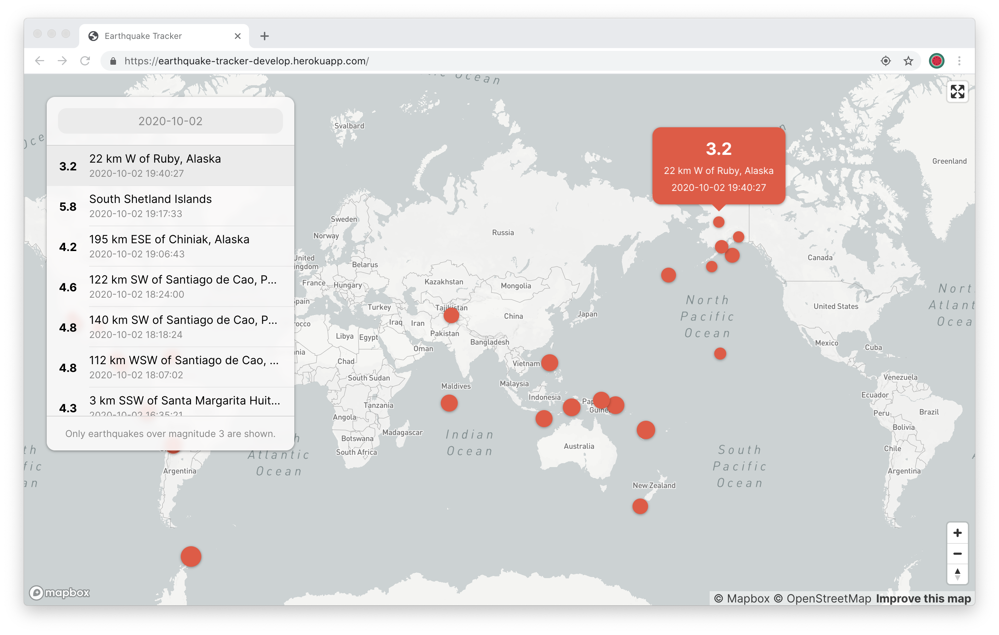
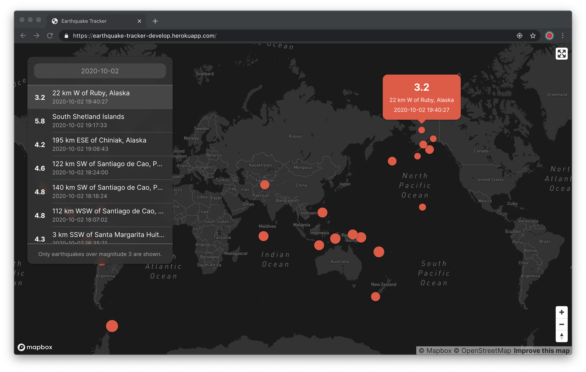

# Earthquake Tracker

This is a project to show the earthquake events recorded daily. It pulls earthquake data from [earthquake.usgs.gov](https://earthquake.usgs.gov/).

It only shows records from earthquakes magnitudes 3 and up (humans can actually feel).

You can access it live via Heroku [here](https://earthquake-tracker-develop.herokuapp.com/).

## Screenshots

It offers both light and dark modes and will automatically adapt to your system's (or browser's) color scheme.

Light Mode


Dark Mode


## Usage

- On first load, the app will show the records on the current day (based on your timezone).
- Clicking the date will open up a calendar and the user can select a date. The app will then show the records on the selected date.
- Clicking on one of the records will open a popup on the map on the location where it took place.
- Clicking on one of the markers on the map will display a popup about the event and will also highlight it on the list.
- The size of the marker shows the strength of the earthquake at the time it was recorded.

## Technologies Used

Designed to be run inside the browser, it primarily uses Web technologies:

- Mapbox to render the map
- Tooling with Webpack 4
- Built with TypeScript and React
- Styling with Styled-Components
- Hot reloading for development using Hot Module Replacement on the development server
- Linting using ESLint
- Unit Testing using Jest

## Requirements

- Node.js (12+)

## Setup

```bash
$ git clone https://github.com/vjcagay/earthquake-tracker.git

$ cd earthquake-tracker

$ npm install

# Development: output will be on ./dev folder
# Remember: The order matters!

# Compile the vendor libraries
$ npm run compile:development:dll

# Compile application code
$ npm run compile:development:source

# Start dev server on http://localhost:8080
$ npm start


# Production: output will be on ./dist folder
# Remember: The order matters!

# Compile the vendor libraries
$ npm run compile:production:dll

# Compile application code
$ npm run compile:production:source

# Optional: start http server to serve files
$ npx http-server dist
```

## Development

```bash
# To perform linting
$ npm run lint

# To run tests
$ npm test

# After running the tests you can view the coverage in the browser
$ npm run coverage
```

## Deployment

```bash
# Deploy to Heroku
# Make sure to set the config var before pushing anything
# NPM_CONFIG_PRODUCTION = false
$ git push heroku master
```

## Optimization

- Currently compiling in production mode will perform minification to TypeScript files. Using gzip further compresses bundles down to just 17% of their minified sizes.

- CSS for some libraries used in this project are served from their respective CDNs to further lower down the bundle sizes. See [`src/html/index.html`](src/html/index.html).

## Author

© [vjcagay](https://github.com/vjcagay)

WebPack boilerplate code used in this project: https://github.com/vjcagay/webpack-typescript-styled-components
